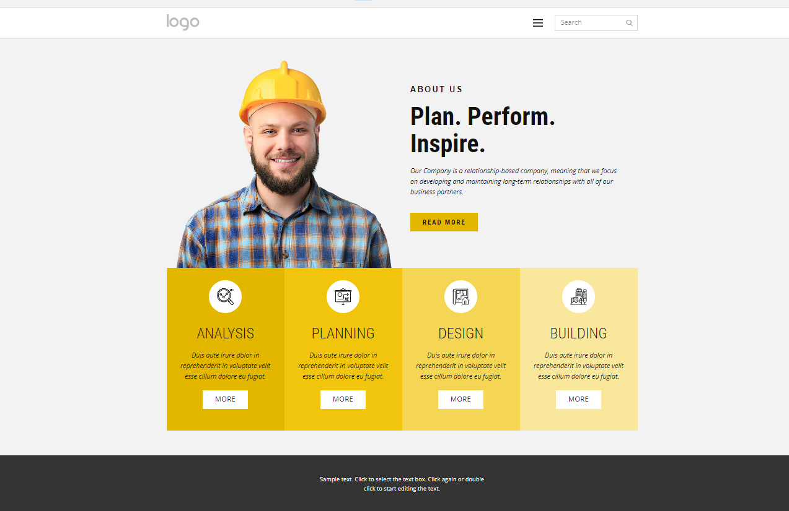

# **Construction Planners Web Page** 

[Design support page](https://nicepage.com/ht/18217/building-constructions-html-template)

## **10 Important Features Your Construction Company Website Should Have**

Just having a website for your construction company is not necessarily enough to generate sufficient business to stay afloat in a competitive landscape. A business website needs to employ important features such as testimonials and reviews, as well as feature professionally shot, beautiful images that keep potential clients on the page and copy that keeps them engaged enough to consider your company for their project. 

It’s fundamental to include all of the information that your potential clients want and need on your website. Below we will take a look at ten essential features that you cannot afford to disclude from your business website if you want to continue to grow your construction business.

### **1. Search Engine Optimization**
Search engine optimization (SEO) is a non-negotiable. SEO is necessary to ensure that your website appears in search engine results. Chances are, you’re not an SEO expert. That’s okay. Most construction firms partner with website design agencies that also offer SEO services to ensure that their site is not only attractive to clients, contractors, and applicants, but also optimized to show up in the top of the search results for their niche. 

### **2. Professional Images**
All images on your website should be professional, high quality, and relevant to your construction company. It’s wise to have a professional photographer take pictures of your projects, offices, and staff. Professional images help to lend credibility to your work and enrich your content by giving stakeholders and potential clients a look into your work culture, your accomplishments, and your design ethos.

### **3. Responsive, Mobile-Friendly Website Design**
Roughly ¾ of your visitors are on mobile devices. Make sure your website is mobile-friendly and loads quickly. This means ensuring that your website is designed from the ground up to be adaptable to any screen, whether it be a phone, tablet, laptop or desktop. Many customers won’t wait more than a few seconds for your website to load before moving on to the next result, and they definitely won’t stick around if your site doesn’t display properly on their phone. When you partner with a website design agency, you can rest assured that mobile-friendly design is at the top of their list, and that your site is going to be seen by the right people no matter where they are or what device they’re using.

### **4. Company Information**
Because your website needs to contain all of the information your customers are looking for, ensure that you include your company’s information. Include a comprehensive list of services you provide. Other information to include is your company values and a description of how you started and your future goals. Don’t forget to list your office hours, location, and phone number, preferably at the bottom or top of every page. Persistent contact information is actually a crucial tool in ensuring that your clients and potential clients can contact you when they need with as little friction as possible.

### **5. Project Gallery**
Your site should feature case studies for every project you have completed. Create a dedicated project gallery that showcases images of your work alongside the scope and timeline of your projects. The project gallery gives new customers a real-world example of the quality of your work and shows off your prowess in the industry. Include your best examples in your gallery subpage and reserve images of smaller projects for your social media profiles.

### **6. Call to Action**
Each subpage of your website should have a clear call to action that compels customers to contact you. Make your call to action colorful and bold, so it doesn’t get missed. Feel free to experiment with different banners, text, and colors to see which works best. If you offer free estimates, include that information in your call to action and contact form.

### **7. Testimonials**
Current and former customer testimonials are a crucial part of your website. Your testimonials from happy clients allow potential clients to see what others think of your business and its services. Reviews have become a core element of how people choose businesses they are willing to invest their funds in - in fact, nine out of ten consumers read online reviews before buying a product or service. 

### **8. Social Media Links**
Offer multiple ways for customers, clients, and employees to engage with you by including links to all of your social media profiles on your website. Your audience needs to know important news and new projects that you’re working on. You can include your social media links as part of your header or footer to show up on all of your subpages so that visitors won’t miss them.

### **9. Team Members**
Including a subpage with profiles of your team members, employees, or partners helps potential clients feel like they can get to know your company. Cultivating relationships with your customers helps you close sales faster and gain referrals.

### **10. Contact Form**
Don’t forget to have a contact form on your website for potential clients to get in touch with you. Place visible links to your contact form on each subpage of your website. Many companies place it into a floating banner or at the top of the page. Contact forms should also be linked in your call to action.

## **Section examples**

**About Us Section**

